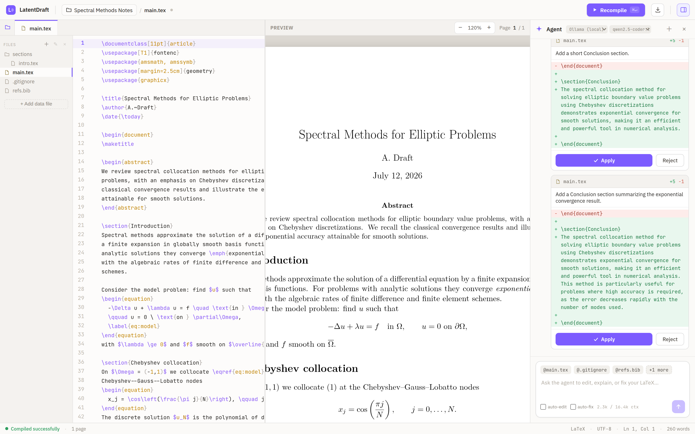
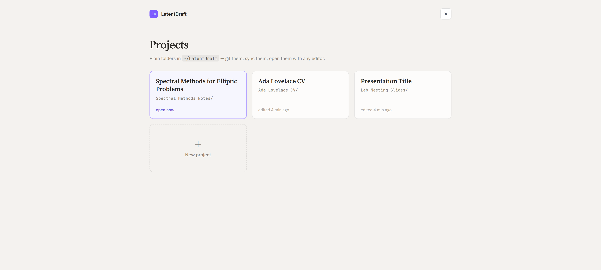

# LatentDraft

[](https://github.com/tchauffi/LatentDraft/actions/workflows/ci.yml)
[](LICENSE)

A local latex editor boosted by agents. Three panes:

- **Editor** — multi-file LaTeX source (CodeMirror) with autocomplete (`\cite{`/`\ref{` keys extracted from your project), inline compile-error squiggles, and SyncTeX (Ctrl/Cmd+click a source line to jump the PDF; double-click the PDF to jump to the source)
- **Preview** — the compiled PDF, live-updating as you type
- **Chat** — an AI agent that reads and edits **any project file** (proposed as accept/reject diffs), creates files, generates figures, and can auto-fix compile failures. When it needs a decision, it asks with **clickable answer choices** (plus a free-text "Other…"). Slash commands (type `/` for autocomplete): `/check-bibtex` verifies your references — including that the cited papers actually exist; `/find-refs` finds real papers to cite (Crossref/arXiv) and inserts their BibTeX; `/review` proofreads with a numbered fix plan; `/check-submission` checks page limits, margins, and anonymization against a venue's rules; `/apply <job-url>` tailors your resume to a job posting — the plan-first commands only edit after you approve

**Projects are plain folders** under `~/LatentDraft` (or `PROJECTS_ROOT`): normal `.tex`/`.bib`/figure files you can `git init`, edit with other tools, or drop an existing paper into. Everything autosaves; build artifacts stay out of the way in `.latentdraft/` (gitignored automatically). New projects start from a template gallery (article, beamer, CV).

The agent is **provider-agnostic**: it defaults to a local **Ollama** model (no API key), and can also use any OpenAI-compatible endpoint (LM Studio, vLLM, OpenRouter, OpenAI) or Anthropic — all behind one interface (a [Mastra](https://mastra.ai) `Agent` over AI SDK v5 providers).





## Requirements

- **Node.js** 20+
- **Tectonic** — the LaTeX engine. `npm run setup` fetches a binary into `./bin/tectonic` (or symlinks a system install); to fetch it manually:
  ```sh
  cd bin && curl --proto '=https' --tlsv1.2 -fsSL https://drop-sh.fullyjustified.net | sh
  ```
  (Or install system-wide and set `TECTONIC_BIN=/path/to/tectonic`.) The **first** compile downloads LaTeX packages and is slow; later compiles hit the cache.
- **Ollama** (for the default agent) — install from https://ollama.com, then pull a model:
  ```sh
  ollama serve            # if not already running
  ollama pull qwen2.5-coder   # or llama3.1 / mistral-nemo — tool-capable models work best
  ```
  Models that can't call tools still work via a fenced-block edit fallback.
- **Python** (for the `run_python` / `view_pdf` / `ats_check` tools) — a virtualenv with matplotlib, seaborn, pandas, numpy, openpyxl and PyMuPDF at `server/.venv`. `npm run setup` creates it; manually:
  ```sh
  cd server && python3 -m venv .venv && .venv/bin/pip install matplotlib seaborn pandas numpy openpyxl pymupdf
  ```
  (Or point `PYTHON_BIN` at any interpreter that has those packages.)
- **Mermaid** (for the `render_mermaid` tool) — installed automatically with `npm install` (`@mermaid-js/mermaid-cli`; puppeteer downloads a headless Chromium on first install).

## Install & run

```sh
npm install       # installs client + server (npm workspaces)
npm run setup     # fetches the Tectonic binary + creates the Python venv (SKIP_VENV=1 to skip)
npm run dev       # starts API (:5174) and Vite dev server (:5173)
```

Open http://localhost:5173.

### Production

```sh
npm run build     # builds the client to client/dist
npm start         # serves UI + API together on http://127.0.0.1:5174
```

## Security

LatentDraft is a **single-user, local tool**. The server binds to `127.0.0.1` by default, has **no authentication**, and the agent's `run_python` tool **executes arbitrary code on your machine** — that is the feature, but it means every API endpoint is as trusted as your own shell. Never set `HOST=0.0.0.0` (or put the server behind a reverse proxy) on a network you don't fully trust without adding an authentication layer in front.

## Configuration (environment variables)

The server reads these at startup (plain environment variables — there is no `.env` loader; see `.env.example` for a template you can `source`):

| Variable            | Default                  | Purpose                                              |
| ------------------- | ------------------------ | ---------------------------------------------------- |
| `PROJECTS_ROOT`     | `~/LatentDraft`          | Directory holding the project folders                |
| `SKILLS_ROOT`       | `~/.latentdraft/skills`  | Directory holding global [skills](#skills-bring-your-own-commands) |
| `PORT`              | `5174`                   | API server port                                      |
| `HOST`              | `127.0.0.1`              | Bind address. Keep localhost — `run_python` executes arbitrary code |
| `COMPILE_TIMEOUT_MS`| `300000`                 | Kill a Tectonic compile after this many ms           |
| `TECTONIC_BIN`      | `./bin/tectonic`         | Path to the Tectonic binary                          |
| `OLLAMA_BASE_URL`   | `http://localhost:11434` | Ollama host                                          |
| `OLLAMA_NUM_CTX`    | `16384`                  | Context window for Ollama models. Ollama's default (4096) silently truncates the prompt — losing the agent's instructions — on any real task, so the server creates a derived `<model>-ctx<N>:latentdraft` variant with this context baked in and uses it transparently (`ollama rm` the variants to clean up; `0` disables). |
| `OLLAMA_CLOUD_API_KEY` | —                     | Enables the "Ollama Cloud" provider (an [ollama.com](https://ollama.com) API key; `OLLAMA_API_KEY` works too). Signed-in daemons also proxy cloud models (`*-cloud` in `ollama list`) through the local provider with no key needed |
| `OLLAMA_CLOUD_MODELS` | —                      | Comma-separated cloud model ids to show instead of the cloud listing (e.g. `gpt-oss:120b,qwen3-coder:480b`) |
| `OPENAI_BASE_URL`   | —                        | Enables the "OpenAI-compatible" provider (e.g. `https://api.openai.com/v1`) |
| `OPENAI_API_KEY`    | —                        | Key for the OpenAI-compatible endpoint               |
| `OPENAI_MODELS`     | —                        | Comma-separated model ids to show in the picker      |
| `OPENAI_CONTEXT_LENGTH` | —                    | Context window (tokens) of the OpenAI-compatible models, for the chat pane's context meter — the server can't discover it |
| `ANTHROPIC_API_KEY` | —                        | Enables the Anthropic provider                       |
| `ANTHROPIC_MODELS`  | `claude-opus-4-8,claude-sonnet-5` | Anthropic models to show                    |
| `PYTHON_BIN`        | `server/.venv/bin/python` | Interpreter for `run_python`/`view_pdf`/`ats_check` |
| `TAVILY_API_KEY`    | —                        | Use Tavily for `web_search` (else Brave, else DuckDuckGo) |
| `BRAVE_API_KEY`     | —                        | Use the Brave Search API for `web_search`            |
| `CROSSREF_MAILTO`   | —                        | Contact email sent with `check_bibtex`'s Crossref lookups — opts into their [polite pool](https://api.crossref.org/swagger-ui/index.html), which is far less likely to rate-limit |

Example — add OpenAI alongside Ollama:

```sh
OPENAI_BASE_URL=https://api.openai.com/v1 OPENAI_API_KEY=sk-... OPENAI_MODELS=gpt-4o-mini npm run dev
```

Switch provider/model from the dropdowns in the Chat pane header.

## How the agent works

The agent runs a multi-step loop against a **working copy** of your document, using these tools:

- `edit_document(old_string, new_string)` — applies an edit to the working copy and shows it to you as a diff card. If the model omits `old_string` but sends only a fragment, the fragment is inserted before `\end{document}` instead of nuking the document.
- `read_document()` — reads the current working copy back, so the model can re-anchor after a failed edit.
- `compile_check()` — compiles the working copy with Tectonic and returns success or the error log.
- `web_search(query)` — researches on the web (DuckDuckGo by default; Tavily/Brave with a key).
- `fetch_url(url)` — fetches one specific web page and returns its readable text (a job posting, an article, docs). Login-walled or JavaScript-only pages degrade gracefully: the agent is told to ask you to paste the text instead of guessing.
- `run_python(code)` — runs Python (matplotlib, seaborn, pandas, numpy, openpyxl) in the build dir, mainly to generate figures you then `\includegraphics`. The agent compiles in the **same session directory as your preview**, so a generated figure still resolves after you accept the edit. Generated files appear in the editor's file tree (purple dot); click one to preview it.
- `render_mermaid(code, filename?)` — renders a Mermaid diagram (flowchart, sequence, class, state, ER, gantt, pie, mindmap, …) to a print-quality PNG in the build dir, for conceptual/structural figures that would be awkward to draw in matplotlib.
- **Data import**: the *"+ Add data file"* button under the file tree uploads a CSV/Excel/image into the compile session — the agent can then `pd.read_csv`/`pd.read_excel` it in `run_python` and plot it with seaborn.
- `view_pdf()` — compiles and **inspects the PDF's actual layout**, returning a text report the model can act on: page count/paper size, per-page text coverage and margins, content clipped at page edges, Overfull `\hbox` lines with `main.tex` line numbers, near-empty trailing pages, and font usage. This is how text-only local models "see" the result; vision-capable models additionally get the rendered page images.
- `ats_check(job_description?)` — extracts the compiled PDF's text and reports ATS parseability, contact/section coverage, and keyword match against a posting.
- `check_bibtex(verify_online?)` — verifies the bibliography, no compile needed. Locally: every `\cite`-style key must resolve to a `.bib` entry or `\bibitem`, unused entries and missing `\bibliography` targets are flagged, each problem quoted at its source line. Online (the interesting part): every **cited** entry is checked against **Crossref** (does the DOI exist, and does it resolve to the *claimed* paper?), **arXiv** ids, and a Crossref title search — catching **hallucinated references**, the fake-but-plausible papers and DOIs LLMs love to invent. Verdicts are conservative: a network failure reports as "could not check", never as fabricated. Type `/check-bibtex` in the chat to run the whole workflow; like compiles, the bibliography is **re-checked at the end of the turn** if the agent edited files after checking, so fixes can't go unverified.

- `find_references(query, max_results?)` — the constructive counterpart to `check_bibtex`: searches **Crossref and arXiv** for real papers matching a topic, claim, or half-remembered title, and returns candidates **with ready-to-insert BibTeX** built verbatim from the records (existing bibliography entries are recognized and reused; generated keys never collide). The agent is forbidden from writing `.bib` entries from memory — memory invents papers; this tool can only cite ones that exist.
- `ask_user(question, options)` — presents a question with 2–5 **clickable answer choices** in the chat (plus an "Other…" free-text escape). Your click is sent as the next message, so the agent can ask "which file is the resume?" or "apply the plan?" without you typing.

Only `edit_document` changes your document, and every edit is yours to accept or reject.

### Slash commands

Type `/` in the chat composer for an autocomplete menu of built-in workflows:

- **`/apply <job-url>`** (or `/apply` + a pasted job description) — tailor your resume to a specific posting. The agent fetches the posting, reads your resume, and scores it with `ats_check` against the job description; then it replies with the role's key requirements, a strengths/gaps review, and a **numbered improvement plan** — *without touching your document*. Reply to approve the plan (or change it), and only then does the agent edit, recompile, and re-run `ats_check` to confirm the keyword coverage actually improved. It will never invent experience or skills to match the posting; if a posting is behind a login wall (LinkedIn often is), it asks you to paste the text instead of guessing. Works best with a mid-size model or better — very small local models can struggle to hold the plan-first discipline.
- **`/check-bibtex`** — verify your references, including that the cited papers actually exist (see `check_bibtex` above).
- **`/find-refs <topic or claim>`** — find real papers to cite. The agent searches Crossref/arXiv with `find_references`, shows you the candidates (title, authors, year, venue), and inserts the best match's BibTeX **exactly as the databases returned it** plus the `\cite` — as accept/reject diffs, so you can reject and pick another candidate. If nothing genuinely matches, it says so rather than inserting a poor fit.
- **`/review`** — proofread the project: spelling, grammar, clarity, inconsistent terminology/notation, undefined acronyms, tense shifts, and LaTeX-level nits. Replies with an assessment and a **numbered findings list** quoting the exact text at each location; tell it which numbers to apply (or "all") and it edits, recompiles, and summarizes. It never changes technical meaning while rewording.
- **`/check-submission <venue / rules>`** — check the document against a venue's submission requirements (e.g. `/check-submission NeurIPS 2026, 9 pages excl. refs, anonymized`; name just the venue and it looks up the author guidelines). It reads the **real layout** via `view_pdf` — page count, margins, fonts, overfull lines — and hunts the source for anonymization leaks (authors, emails, acknowledgements, "our previous work"). Replies with a pass/fail checklist and a numbered fix plan; edits only after you approve, then re-verifies.

The chat bubble shows the command you typed; the agent receives the full workflow instruction behind it. The plan-first commands (`/review`, `/check-submission`, `/apply`) typically end their first turn with clickable **approve / change** choices via `ask_user`.

So a typical turn is: **edit → compile_check → (if it fails) read the log, fix, compile_check again → summarize.** This means the changes it proposes are **verified to compile** before you ever see them. When the turn ends you get a green *"✓ Verified — the document compiles with these changes"* banner (or a red one with the log if it couldn't).

You stay in control:

1. Each edit appears as a diff card with **Accept / Reject** — nothing is applied to your editor automatically.
2. **Accept** (or **Accept all**) performs the exact string replacement in the editor and triggers a recompile. Accept multi-edit sets top-to-bottom so later edits build on earlier ones.
3. If an `old_string` doesn't match uniquely, the card shows why (not found / matches multiple places) instead of applying a wrong edit.

The loop is built to survive **small local models** that fumble tool calling. If the model writes its tool call as plain text instead of a native call — bare `{"name": …, "arguments": {…}}` JSON, `<tool_call>` tags, fenced ` ```json ` blocks, or `tool_name({…})` pseudo-code — the server recovers it, executes it for real, feeds the result back, and continues the loop. `<think>…</think>` reasoning from thinking models is stripped from the chat. Repeated identical edits are rejected so the model can't apply the same insertion twice. Models that can't produce tool calls in any form still fall back to emitting ` ```latex-edit ` blocks — you get diff cards, but without the agent's self-verification.

### Skills (bring your own commands)

The built-in commands above are baked in — **skills** are the same idea, but yours. Drop a folder containing a `SKILL.md` into `~/.latentdraft/skills/` (available in every project) or `<project>/.latentdraft/skills/` (just that project) and it becomes **both** a `/slash` command in the composer **and** a skill the agent loads on its own (via its `skill` tool) when your request matches the description. The format is the Agent Skills convention used by Claude Code — skills written for Claude Code load unchanged, since unknown frontmatter keys (`allowed-tools`, `metadata`, …) are simply ignored:

```markdown
---
name: thank-reviewers
description: Draft a polite point-by-point response letter to the paper's reviewers
---

Read every .tex file in the project first. Then draft the response letter as
sections/rebuttal.tex: quote each reviewer point, answer it, and reference the
change made in the paper. Keep the tone appreciative and concrete…
```

`description` is required — it is the autocomplete blurb *and* what the model matches your request against, so write it like a trigger ("Use when…"). `name` is optional; the folder name is used otherwise (normalized to lowercase-and-dashes). A project skill shadows a global skill of the same name, and built-in commands always win over skills. Skills are re-read at the start of every agent turn, so editing a `SKILL.md` takes effect on your next message — no restart.

## Project layout

```
server/   Express API (tsx). /api/compile (Tectonic), /api/chat (Mastra agent), /api/providers
          In production (npm start) it also serves the built client from client/dist.
client/   Vite + React. EditorPane, PreviewPane, ChatPane
scripts/  setup.sh — fetches Tectonic, creates the Python venv
bin/      tectonic binary, fetched by npm run setup (gitignored)
```

## Notes & limits

- The editor's file tabs (`main.tex`, `refs.bib`, `sections/…`) are all sent along on every compile, so `\input` and `\bibliography` resolve — for both the live preview and the agent's `compile_check` sandbox. The agent reads and edits **any project file**.
- The file tree works like VS Code's: create files of **any text type** (`.tex`, `.py`, `.md`, `.yml`, `.json`, `.sh`, …) or **folders** (including empty ones) via inline naming — `/` in the name nests; folders collapse/expand on click and can be renamed or deleted (with contents) from their hover actions. Python, Markdown, YAML, JSON, and shell buffers get syntax highlighting; `.tex` additionally keeps LaTeX autocomplete, compile squiggles, and SyncTeX.
- Stale compile dirs under `server/tmp/` are deleted automatically after 24h (on server start).
- The document is sent to the model on each chat turn; very large documents may exceed a local model's context window.

## License

[AGPL-3.0](LICENSE). If you run a modified LatentDraft as a network service, the AGPL requires you to make your modified source available to its users.
